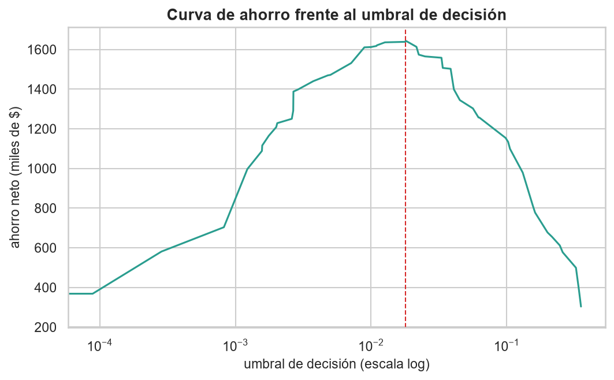
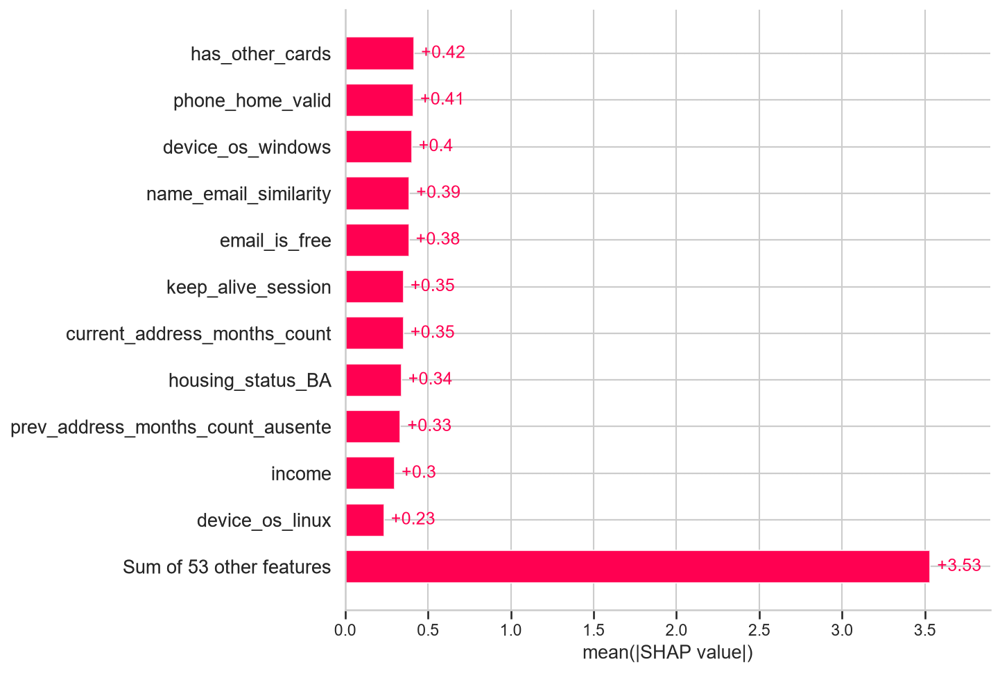

# CENTINELA

**Sistema de apoyo a la decisión para la detección de fraude en solicitudes de apertura de cuentas bancarias**

Trabajo Fin de Máster — **Data Science, Big Data & Business Analytics · UCM**  
**Emilio Andrés Navarro Vergara · 2026**


---

## Descripción

CENTINELA es un proyecto end-to-end de detección de **new account fraud**. El objetivo no es únicamente estimar si una solicitud presenta riesgo de fraude, sino convertir esa predicción en una **decisión operativa** que pueda ser calibrada, explicada, auditada, monitorizada y desplegada.

El proyecto integra:

- validación temporal;
- comparación y optimización de modelos de machine learning;
- calibración isotónica de probabilidades;
- selección de umbral bajo restricciones de capacidad operativa;
- evaluación económica;
- explicabilidad mediante SHAP;
- auditoría de equidad;
- monitorización de deriva mediante PSI;
- API REST con FastAPI y Pydantic;
- dashboard operativo y cuadro de mando ejecutivo.

---

## Resultados principales

| Métrica / indicador | Resultado |
|---|---:|
| ROC AUC — test final | **0,8891** |
| Average Precision — test final | **0,1764** |
| Recall @ 5 % FPR | **52,8 %** |
| Brier calibrado | **≈ 0,0125** |
| Umbral operativo congelado | **0,0330** |
| Objetivo de capacidad — mes 5 | **300 alertas/día** |
| Carga observada — test | **≈ 337 alertas/día** |
| Recall operativo | **≈ 66 %** |
| Exposición fraudulenta base — test | **USD 2.316.970** |
| Ahorro neto estimado — política operativa | **USD 1.558.270** |
| IC 95 % del ahorro | **USD 1,46 M – 1,65 M** |

El máximo económico teórico estimado alcanza **USD 1.642.950**, aunque requiere revisar aproximadamente el **18,3 %** de las solicitudes. Por ello, el punto de operación final se define bajo una restricción explícita de capacidad de revisión.



---

## Diseño temporal

Para evitar fuga de información y representar mejor un escenario productivo, el futuro nunca participa en decisiones tomadas con datos anteriores.

```text
Meses 0–3  → desarrollo y comparación de modelos
Mes 4       → selección de configuración
Meses 0–4  → entrenamiento final
Mes 5       → calibración de probabilidades y definición de políticas
Meses 6–7  → test final bloqueado
```

El umbral operativo se selecciona en el mes 5 y se mantiene **congelado** durante la evaluación final.

---

## Modelado

Se compararon cuatro familias de modelos:

- Regresión Logística
- Random Forest
- XGBoost
- LightGBM

El sistema final utiliza **LightGBM**, optimizado con **Optuna** y ponderación de clases. La salida del modelo se transforma posteriormente mediante **calibración isotónica**.

La evaluación combina métricas discriminativas y de calibración con restricciones económicas y operativas. La selección no se basa únicamente en maximizar AUC.

---

## Evaluación económica y operación

La exposición asociada a una solicitud fraudulenta aprobada se aproxima mediante el límite de crédito solicitado bajo un supuesto base de severidad del 100 %. La revisión manual tiene un coste de **USD 10 por alerta**.

La política seleccionada busca equilibrar:

```text
riesgo evitado  ↔  coste de revisión  ↔  capacidad operativa
```

El objetivo de 300 alertas diarias se definió en el mes 5. Al aplicar el mismo umbral sin cambios sobre el test, la carga observada aumentó a aproximadamente 337 alertas/día, reflejando el efecto de la deriva temporal.

---

## Explicabilidad

CENTINELA utiliza **SHAP** para explicar la puntuación generada por LightGBM.



Los valores SHAP explican la salida interna de LightGBM **antes de la calibración isotónica**. La probabilidad mostrada al usuario de la API corresponde, en cambio, a la probabilidad calibrada utilizada para la decisión operativa.

---

## Auditoría de equidad

Como ejercicio académico se analizó la disparidad de FPR entre dos grupos de edad: `< 50` y `≥ 50` años. El corte de 50 años se utiliza únicamente como partición analítica y no representa un criterio legal, regulatorio o normativo.

La mitigación se define exclusivamente con el mes 5 y posteriormente se aplica congelada al test:

| Indicador | Política original | Política mitigada |
|---|---:|---:|
| Ratio de FPR | **2,76×** | **≈ 1,13×** |
| Coste económico de mitigación | — | **USD 28.640** |
| Coste relativo sobre el ahorro | — | **≈ 1,8 %** |

Este análisis no constituye una recomendación automática de uso en producción.

---

## Monitorización de deriva

La estabilidad de las variables se monitoriza mediante **Population Stability Index (PSI)**.

El PSI se utiliza como señal de investigación, no como una orden automática de reentrenamiento:

```text
Monitorizar → Investigar → Recalibrar → Valorar reentrenamiento
```

Los resultados de monitorización están disponibles en [`outputs/reportes/monitor_psi.csv`](outputs/reportes/monitor_psi.csv).

---

## API

El sistema se empaqueta en un artefacto que contiene:

- preprocesador;
- modelo LightGBM;
- calibrador isotónico;
- umbral operativo;
- metadatos necesarios para inferencia.

La API está implementada con **FastAPI + Pydantic** y expone:

- `GET /salud`
- `POST /predecir`

La respuesta de `/predecir` incluye:

- probabilidad calibrada de fraude;
- decisión operativa;
- umbral aplicado;
- exposición asociada;
- coste esperado de aprobación;
- coste de revisión;
- principales factores SHAP.

### Ejecutar la API localmente

```bash
pip install -r requirements.txt
cd outputs/api
uvicorn app:app --reload
```

Después abrir:

```text
http://127.0.0.1:8000/docs
```

---

## Dashboards

El repositorio contiene dos capas de visualización:

- [`TFM_Dashboard_Centinela.ipynb`](TFM_Dashboard_Centinela.ipynb): generación del dashboard y monitorización.
- [`outputs/dashboard/centinela_ops.html`](outputs/dashboard/centinela_ops.html): dashboard operativo interactivo.
- [`CENTINELA_Ejecutivo.pbix`](CENTINELA_Ejecutivo.pbix): cuadro de mando ejecutivo en Power BI.

---

## Estructura del repositorio

```text
centinela-fraud-detection/
│
├── TFM_Deteccion_Fraude_Emilio_Navarro.ipynb
├── TFM_Dashboard_Centinela.ipynb
├── config.ipynb
├── Memoria_TFM_Emilio_Navarro.docx
├── CENTINELA_Ejecutivo.pbix
├── requirements.txt
│
├── data/
│   └── referencias al Bank Account Fraud Dataset Suite
│
└── outputs/
    ├── Anexos-html/
    ├── api/
    │   ├── app.py
    │   └── ejemplo_solicitud.json
    ├── dashboard/
    │   └── centinela_ops.html
    ├── figuras/
    ├── modelos/
    │   └── centinela_v1.joblib
    ├── powerbi/
    └── reportes/
        ├── comparativa_modelos.csv
        ├── kpis_financieros.json
        ├── metricas_modelo_final_test.csv
        └── monitor_psi.csv
```

---

## Instalación

### 1. Clonar el repositorio

```bash
git clone https://github.com/emilionavarro454-lab/centinela-fraud-detection.git
cd centinela-fraud-detection
```

### 2. Crear un entorno virtual

**Windows**

```bash
python -m venv venv
venv\Scripts\activate
```

**Linux / macOS**

```bash
python -m venv venv
source venv/bin/activate
```

### 3. Instalar dependencias

```bash
pip install -r requirements.txt
```

Entorno principal del proyecto: **Python 3.12**. Semilla global utilizada: **42**.

---

## Datos

El proyecto utiliza **Bank Account Fraud Dataset Suite (BAF)**, publicado por Feedzai y asociado a NeurIPS 2022.

El conjunto Base contiene aproximadamente **1 millón de solicitudes** y una prevalencia de fraude cercana al **1,1 %**. El análisis utiliza una estructura temporal de ocho meses.

Los datos originales deben obtenerse desde su fuente oficial y utilizarse de acuerdo con las condiciones de licencia correspondientes. Este repositorio está orientado a documentar el código, resultados y artefactos desarrollados para el TFM.

---

## Limitaciones

- El dataset es sintético y no representa directamente una cartera bancaria productiva.
- La evaluación económica depende de supuestos explícitos sobre severidad y coste de revisión.
- La ventana disponible para calibración y evaluación temporal es limitada.
- La auditoría de equidad es académica y requeriría una gobernanza adicional antes de cualquier uso real.
- La deriva detectada debe investigarse antes de decidir una recalibración o un nuevo entrenamiento.

---

## Tecnologías

`Python` · `pandas` · `NumPy` · `scikit-learn` · `LightGBM` · `XGBoost` · `Optuna` · `SHAP` · `FastAPI` · `Pydantic` · `Plotly` · `Power BI`

---

## Autor

**Emilio Andrés Navarro Vergara**  
Trabajo Fin de Máster — Data Science, Big Data & Business Analytics  
Universidad Complutense de Madrid · 2026

---

> **CENTINELA:** una predicción adquiere valor cuando puede convertirse en una decisión comprensible, ejecutable y supervisable.
